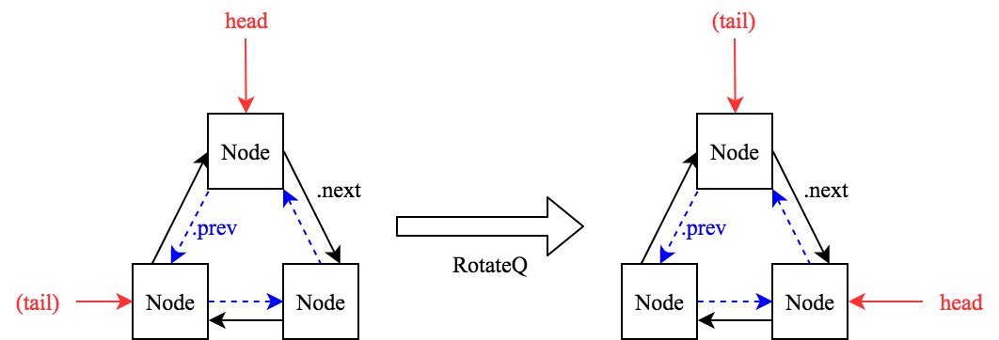

Here I assemble all the useful resources I have collected so far for both Assignment #1 Part 1 and Project #1.

**Part 2 is due on FEB 20th in class!!!**
**Project 1 is due on FEB 20th at 2359 hours!!! And you have to use this one in groups.**

[Link to Homework Assignment 1 description](http://cactus.eas.asu.edu/partha/Teaching/330.2018/Projects-2018/HW-1-2018.htm){:target="_blank"} 

[Link to Project 1 description](http://cactus.eas.asu.edu/partha/Teaching/330.2018/Projects-2018/HW-1-2018.htm){:target="_blank"} 

Semaphore
---
* Textbook(10th) Chap 6.1 - 6.6 
* (Update) **NOTE on the Dijkstra's semaphore vs blocking semaphore ** Busy waiting is that you put the waiting process in a while loop, which keeps checking itself whether it’s good or not to let go. Meanwhile blocking utilizes a timer that puts the blocked process on hold for a set amount of time. Busy waiting consumes a lot of CPU power while blocking does not.
* (Update)[Busy waiting vs blocking](https://stackoverflow.com/questions/26541119/whats-different-between-the-blocked-and-busy-waiting)
* [Slides by Prof. Gagan Agrawal from OSU](http://web.cse.ohio-state.edu/~agrawal.28/760/Slides/jan12.pdf)
* [Slides by Prof. Ed Lazowska from U Washington](https://courses.cs.washington.edu/courses/cse451/10au/lectures/8-sema_mon.pdf)

Bi-directional Circular Queue
---
* **DO NOT USE DUMMY ELEMENTS!** There's no point using them.
* What rotateQ is supposed to do is shown below. Notice you don't need to implement a tail pointer, but it's easier to understand with a tail.

* (Update) Q-element can technically be of any type. You may want to look into 'auto' type supported since C++11. 
* (Update) A good test file should at least call every single function once in order to demonstrate your entire functionality.

Free free to reach me using the email button below. And I'll see you guys in recitation sessions!

