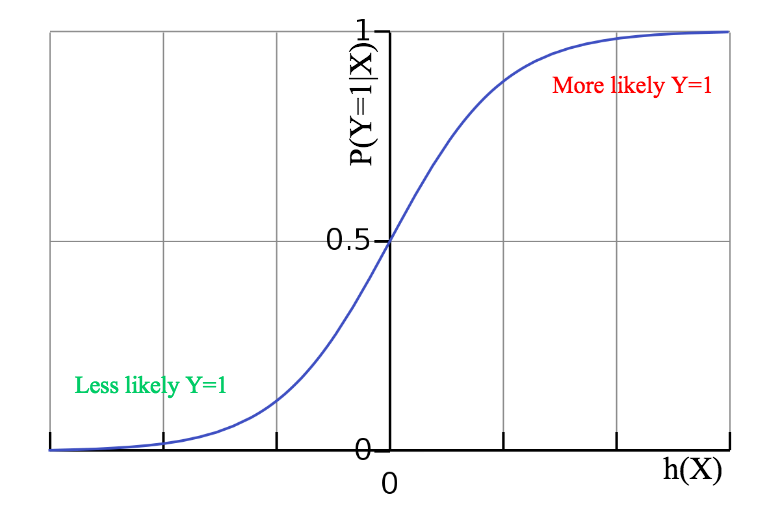

This post is going to share some of my own thoughts on the concept of logistic regression. Notice it is not going to be superbly rigid, but rather I'd like build up some intuition.

## Understanding the hypothethis

First of all, logistic regression comes hand in hand with linear regression.

Inspired by [UCI Wine dataset](https://archive.ics.uci.edu/ml/datasets/wine), let's imagine we want estimate the price of each single bottle of wine given its feature stats (e.g. alcohol, color intensity, and such). We assume the result price depends on a linear relationship regarding each feature, and we'd like to use such a linear function so that we can estimate the price given a single wine datum in future. Intuitively, we can write down this weighted sum equation given a n-feature bottle data $$X = (x_1, x_2, ... , x_n)$$:

$$
\begin{equation*}
\begin{aligned}
Price = w_0 + w_1x_1 + w_2x_2 + ... + w_nx_n
\end{aligned}
\end{equation*}
$$

where $$w_0$$ is the bias, or essentially the base price for each bottle. Each single scalar weight give outs which feature matters more to affect the final price of the wine.

To put it more generalized, we name the aforementioned weight sum a **linear regression hypothesis**, and the weights its **parameters**. The hypothesis offers a specific measure to describe your data tuned by the parameters.

$$
\begin{equation*}
\begin{aligned}
h_w(X) = w_0 + w_1x_1 + w_2x_2 + ... + w_nx_n \\ 
= \sum_{i=0}^{n} w_ix_i 
= w^TX {\hspace{1cm}} where \space x_0 = 1
\end{aligned}
\end{equation*}
$$

## Projecting the hypothethis

We use logistic regresssion to tackle classification. In a simple scenario, we only consider 0-1 classification/binomial classification.

What does the s-shaped function mean? The logistic function, or the $$sigmoid(x)$$ function projects the continuous x fairly into the range of $$(0, 1)$$, meanwhile the fucntion is differentiable. So if we can tune the hypothesis' parameters well enough, we may eventually have the hypothesis aligned with the classification probabilities. In other words, the linear hypothesis result can be projected as a probability of a class given the data.

Thus the **logistic hypothethis** can be understood as **a layer of projection above** corresponding to the linear regression hypothesis.

$$
\begin{equation*}
\begin{aligned}
sigmoid(z) = \sigma(z) = \frac{1}{1+e^{-z}}
\end{aligned}
\end{equation*}
$$

where

$$
\begin{equation*}
\begin{aligned}
z = h_w(X) = \sum_{i=0}^{n} w_ix_i
\end{aligned}
\end{equation*}
$$

Hence the logistic regression hypothesis g(X)

$$
\begin{equation*}
\begin{aligned}
g_w(X) = \frac{1}{1+\exp(-\sum_{i=0}^{n} w_ix_i)}
\\ = \frac{\exp(\sum_{i=0}^{n} w_ix_i)}{1+\exp(\sum_{i=0}^{n} w_ix_i)} 
\end{aligned}
\end{equation*}
\tag{1}
$$

$$= P(Y=1 \mid X)$$
 
and on the other hand

$$
\begin{equation*}
\begin{aligned}
P(Y=0 \mid X) = 1 - P(Y=1 \mid X) \end{aligned}
\end{equation*}
$$

$$= \frac{1}{1+\exp(\sum_{i=0}^{n} w_ix_i)}\tag{2}
$$

So to put it into a graph

 

We can tell if the linear hypothethis passes some threshold, the given datum X will be more likely classified as Y=1.

## How to estimate the weights/parameters

Similarly, in order to find the optimal weights, we may still solve for the maximum likelihood. In this binomial scenario, given a n-feature observation/dataset of $$\{(X_1, Y_1), (X_2, Y_2) ... (X_k, Y_k)\}$$ where $$X_i \in \mathbf{R}^n$$ and $$Y_i \in \{0,1\}$$, the likelihood is

$$
\begin{equation*}
\begin{aligned}
Likelihood = \prod^k_{i=1}P(Y_i=1 \mid X_i)^{Y_i}P(Y_i=0 \mid X_i)^{1-Y_i}
\end{aligned}
\end{equation*}
$$

We are more willing to solve for the log-likelihood $$L(w)$$ so that we can transfer the product into a sum

$$
\begin{equation*}
\begin{aligned}
L(w) = \log(\prod^k_{i=1}P(Y_i=1 \mid X_i)^{Y_i}P(Y_i=0 \mid X_i)^{1-Y_i}) \\
= \sum^k_{i=1}Y_i \log P(Y_i=1 \mid X_i) + (1-Y_i)\log P(Y_i=0 \mid X_i)
\end{aligned}
\end{equation*}
$$

Now we can solve $$\underset{w}{\operatorname{argmax}}L(w) $$ or $$$$\underset{w}{\operatorname{argmin}}-L(w)$$ by bringing in (1) and (2) and taking partial derivatives.