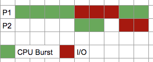

In this post, I am going to list down all external materials that I've found for the entire content throughout the course. Since the final exams are going to be open book, feel free to download them and make best uses of them.

Process
---
* Textbook(10th) Chap 3
* [Process vs Thread on StackOverflow](https://stackoverflow.com/questions/200469/what-is-the-difference-between-a-process-and-a-thread){:target="_blank"}
* [Processes and Threads from MSDN](https://msdn.microsoft.com/en-us/library/windows/desktop/ms684841(v=vs.85).aspx){:target="_blank"}

Scheduling
---
* Textbook(10th) Chap 5.1 - 5.3 
* [Slides by Prof. Raju Pandey from UC Davis](http://web.cs.ucdavis.edu/~pandey/Teaching/ECS150/Lects/05scheduling.pdf){:target="_blank"} **Highly recommended!** You may also look into his [other slides](http://web.cs.ucdavis.edu/~pandey/Teaching/ECS150/Lects/){:target="_blank"} for references.
* [How to Create a Basic Gantt Chart in Microsoft Project 2016](https://www.youtube.com/watch?v=J9uctgUaEic){:target="_blank"} 
* [OS Scheduling Algorithms by Tutorialspint](https://www.tutorialspoint.com/operating_system/os_process_scheduling_algorithms.htm){:target="_blank"} 
* [Slides from Prof. Gagan Agrawal from OSU](http://web.cse.ohio-state.edu/~agrawal.28/660/Slides/jan18.pdf){:target="_blank"} 
* [Notes from U of Rutgers](https://www.cs.rutgers.edu/~pxk/416/notes/07-scheduling.html){:target="_blank"}
* Gantt chart, CPU burst vs IO burst: 

 

Kernel Mode/User Mode
---
* [Article by Microsoft Hardware Dev](https://docs.microsoft.com/en-us/windows-hardware/drivers/gettingstarted/user-mode-and-kernel-mode){:target="_blank"}

Semaphore & Mutex
---
* Textbook(10th) Chap 6.1 - 6.7 
* **NOTE on the Dijkstra's semaphore vs blocking semaphore** Busy waiting is that you put the waiting process in a while loop, which keeps checking itself whether it’s good or not to let go. Meanwhile blocking utilizes a timer that puts the blocked process on hold for a set amount of time. Busy waiting consumes a lot of CPU power while blocking does not.
* (Update)[Busy waiting vs blocking](https://stackoverflow.com/questions/26541119/whats-different-between-the-blocked-and-busy-waiting){:target="_blank"}
* [Slides by Prof. Gagan Agrawal from OSU](http://web.cse.ohio-state.edu/~agrawal.28/760/Slides/jan12.pdf){:target="_blank"}
* [Slides by Prof. Ed Lazowska from U Washington](https://courses.cs.washington.edu/courses/cse451/10au/lectures/8-sema_mon.pdf){:target="_blank"}

Synchronization Classic Problems & Monitor
---
* Textbook(10th) Chap 6.7 and 7.1
* [Monitor and Classic problems by Prof. Gagan Agrawal from OSU](http://web.cse.ohio-state.edu/~agrawal.28/760/Slides/jan17.pdf){:target="_blank"}
* [Solving reader-writer with monitor by Junfeng Yang of Columbia University](https://www.cs.columbia.edu/~junfeng/13fa-w4118/lectures/l10-semaphore-monitor.pdf){:target="_blank"} (Please forgive about Comic Sans in this one)

***
Following are the contents after Midterm 1.

Virtual Memory
---
* Textbook(10th) Chap 10
* [Page Replacement Algortihrms by Prof. Emmett Witchel of U Texas](http://www.cs.utexas.edu/users/witchel/372/lectures/16.PageReplacementAlgos.pdf){:target="_blank"}
* [Belady’s Anomaly w/ FIFO worksheet from ESC 150, UC-Davis](http://nob.cs.ucdavis.edu/classes/ecs150-2008-02/handouts/memory/mm-belady.pdf){:target="_blank"}
* [Slides from UCSD CSE240a](https://cseweb.ucsd.edu/classes/fa10/cse240a/pdf/08/CSE240A-MBT-L18-VirtualMemory.ppt.pdf){:target="_blank"}

Deadlock
---
* Textbook(10th) Chap 8
* Prof. Gagan Agrawal of OSU has a good series on deadlock topics in his CSE6431 course. **Highly recommended!**
	* [Causes of deadlocks, avoidance, Banker's, and WFG](http://web.cse.ohio-state.edu/~agrawal.28/760/Slides/feb23.pdf){:target="_blank"}
	* [Resource Allocation Graph walkthrough](http://web.cse.ohio-state.edu/~agrawal.28/760/Slides/mar7.pdf){:target="_blank"}

Disk Management
---
* Textbook(10th) Chap 11
* [Disks and I/O Scheduling by Prof. Don Porter of UNC](http://www.cs.unc.edu/~porter/courses/comp530/f16/slides/disk-scheduling.pdf){:target="_blank"} **Strongly recommended!**

File Systems
---
* Textbook(10th) Chap 13.1 - 13.4
* [File System Fundamentals by Prof. Don Porter of UNC (including bit-vector and etc)](http://www.cs.unc.edu/~porter/courses/comp530/f16/slides/file-systems.pdf){:target="_blank"}

