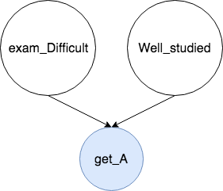

In this post, I will offer you some intuitive understanding about the d-separation in Graphical Models, esp. in Bayes Network (BN). It covers the ideas of conditional independence and local Markov condition. The note is motivated by PRML Chap 8.2 and Question 3 in Assignment 3. 

Bayes' Rule
---
A quick review:

Chain Rule of Probability in BN
---
Recall a Bayes Network is a DAG (Directed Acyclic Graph). And each node only depends on its immediate parent nodes. So in order to figure out the combined probability of all variables $$x_1, ... x_n$$
in the graph, we have the following:

$$
P(x_1, ... x_n) = \prod_{i=1}^{n}P(x_i \mid x_{parents-of-i-combined})
$$

Conditional Indepedence
---
Recall given random variables X, Y, and Z. If it satisfies:

$$
P(X, Y \mid Z) = P(X \mid Z) P(Y \mid Z)
$$

or

$$
P(X\mid Y, Z) = P(X \mid Z) 
$$

Then we have **X and Y are conditionally independent of each other given the condition Z**. $$X \bot Y \mid Z$$.

 
Now with all basics recalled, let's jump into the 3 cases in d-separation. Suppose you are an ordinary high school student who wants to study well.
 
---

Case 1: Common Effect/Collider
---

In this scenario, the difficulty of the exam (event D), which is determined by your teacher, has nothing to do with your own study status (event W). However, if you know your grade (event A), or **you observe on whether you get an A in your exam**, event D and event W are **no longer independent from each other**. 

Intuitively speaking, if the exam is easy AND you have studied well, you are the most likely to get an A. Or else.

To conclude, if the result is **NOT your obversation**, the reasons are independent of each other. It's also called Marginal Independence.

Case 2: Chains
---

In the past, your teacher made the hard exam (D). Now you **observe you have an A grade** (A). Will you get a recommendation letter (R)? Knowing your grade, whether or not you will get recommended is independent from the difficulty of your exam. As an inference, we have

$$
P(D, A, R) = P(D)P(A \mid D)P(R \mid A) 
$$

$$
P(R \mid D, A) = \frac{P(D, A, R) }{P(D, A) }\\
=\frac{P(D)P(A \mid D)P(R \mid A) }{P(D)P(A \mid D)}\\
=P(R \mid A)
$$

Check on the previous Chain Rule and we have thus proved that D and R are conditionally independent given A.

Case 3: Common Cause/Fork
---

Similarly speaking, knowing you get a good grade (A), whether or not you will get recommended by your teacher (R) has nothing to do with your parents buying you an iPhone (I) as a reward. To put into a formula, we have:

$$
P(A, R, I) = P(A)P(R \mid A)P(I \mid A) 
$$

$$
P(R, I \mid A) = \frac{P(A, R, I)}{P(A) }\\
=\frac{P(A)P(R \mid A)P(I \mid A)}{P(A)}\\
=P(R \mid A)P(I \mid A)
$$

And we have thus proved that R and I are conditionally independent given A.
